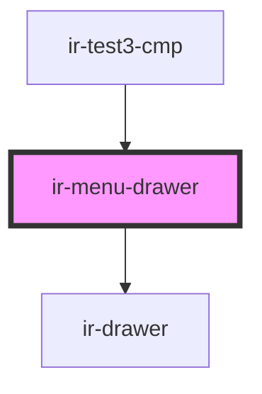

# ir-menu-drawer

<!-- Auto Generated Below -->

## Properties

| Property | Attribute | Description | Type      | Default     |
| -------- | --------- | ----------- | --------- | ----------- |
| `open`   | `open`    |             | `boolean` | `undefined` |

## Methods

### `openDrawer() => Promise<void>`

#### Returns

Type: `Promise<void>`

## Dependencies

### Used by

 - [ir-test3-cmp](../ir-test-cmp)

### Depends on

- [ir-drawer](../ir-drawer)

### Graph

----------------------------------------------

*Built with [StencilJS](https://stenciljs.com/)*
