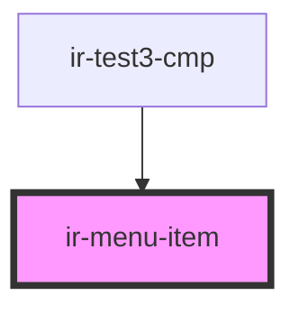

# ir-menu-item

<!-- Auto Generated Below -->

## Properties

| Property   | Attribute  | Description | Type      | Default     |
| ---------- | ---------- | ----------- | --------- | ----------- |
| `badge`    | `badge`    |             | `string`  | `undefined` |
| `href`     | `href`     |             | `string`  | `undefined` |
| `selected` | `selected` |             | `boolean` | `undefined` |

## Dependencies

### Used by

 - [ir-test3-cmp](../ir-test-cmp)

### Graph

----------------------------------------------

*Built with [StencilJS](https://stenciljs.com/)*
