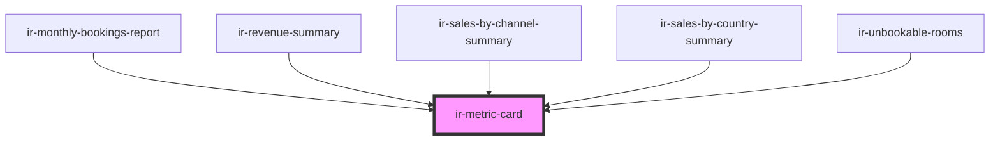

# ir-metric-card

A compact, themeable KPI / metric card. Displays a label, a primary value with an optional unit, an
optional leading icon, a trend delta, a caption, and arbitrary slotted body content. Fully styleable
via CSS parts and custom properties.

## Usage

```html
<!-- Simple value + unit -->
<ir-metric-card label="Guests today" value="124" unit="guests" icon="users" intent="brand"></ir-metric-card>

<!-- With a trend delta -->
<ir-metric-card label="Occupancy" value="86" unit="%" trend="4.2" trend-label="vs last week" intent="success"></ir-metric-card>

<!-- Clickable card with slotted body -->
<ir-metric-card label="Breakfast" value="42" clickable intent="warning">
  <p>Adults 30 · Children 12</p>
</ir-metric-card>
```

<!-- Auto Generated Below -->


## Overview

A compact, themeable KPI / metric card. Displays a label, a primary value with an
optional unit, an optional leading icon, a trend delta, a caption, and arbitrary
slotted body content. Fully styleable via CSS parts and custom properties.

## Properties

| Property      | Attribute      | Description                                                                            | Type               | Default     |
| ------------- | -------------- | -------------------------------------------------------------------------------------- | ------------------ | ----------- |
| `caption`     | `caption`      | Secondary descriptive line shown beneath the value.                                    | `string`           | `undefined` |
| `clickable`   | `clickable`    | Make the whole card interactive: adds hover/focus affordance and emits `metricClick`.  | `boolean`          | `false`     |
| `icon`        | `icon`         | Name of a `wa-icon` rendered in the leading icon chip.                                 | `string`           | `undefined` |
| `invertTrend` | `invert-trend` | Flip trend color semantics so a decrease reads as positive (good).                     | `boolean`          | `false`     |
| `label`       | `label`        | Metric label / title.                                                                  | `string`           | `undefined` |
| `loading`     | `loading`      | Render skeleton placeholders instead of content.                                       | `boolean`          | `false`     |
| `size`        | `size`         | Visual density. `small` is compact (default); `medium` enlarges the value and padding. | `"m" \| "s"`       | `'s'`       |
| `trend`       | `trend`        | Trend delta as a percentage. The sign selects the up/down arrow and color.             | `number`           | `undefined` |
| `trendLabel`  | `trend-label`  | Context text shown beside the trend (e.g. `vs last week`).                             | `string`           | `undefined` |
| `unit`        | `unit`         | Unit rendered after the value (e.g. `guests`, `%`, `nights`).                          | `string`           | `undefined` |
| `value`       | `value`        | Primary metric value. Rendered with tabular figures.                                   | `number \| string` | `undefined` |


## Events

| Event         | Description                                                                      | Type                |
| ------------- | -------------------------------------------------------------------------------- | ------------------- |
| `metricClick` | Emitted when a clickable card is activated by click or keyboard (Enter / Space). | `CustomEvent<void>` |


## Slots

| Slot       | Description                                           |
| ---------- | ----------------------------------------------------- |
|            | Default slot for custom body content below the value. |
| `"footer"` | Footer / actions row.                                 |
| `"icon"`   | Overrides the leading icon.                           |
| `"label"`  | Overrides the label markup.                           |
| `"value"`  | Overrides the value display.                          |


## Shadow Parts

| Part        | Description                             |
| ----------- | --------------------------------------- |
| `"base"`    | The outer card container.               |
| `"body"`    | Wrapper around the default slot.        |
| `"caption"` | The secondary caption line.             |
| `"footer"`  | Wrapper around the footer slot.         |
| `"header"`  | Row holding the icon and label.         |
| `"icon"`    | The leading icon chip.                  |
| `"label"`   | The metric label text.                  |
| `"trend"`   | The trend (delta) indicator.            |
| `"unit"`    | The unit text rendered after the value. |
| `"value"`   | Row holding the primary value and unit. |


## Dependencies

### Used by

 - [ir-monthly-bookings-report](../ir-monthly-bookings-report)
 - [ir-revenue-summary](../ir-daily-revenue/ir-revenue-summary)
 - [ir-sales-by-channel-summary](../ir-sales-by-channel/ir-sales-by-channel-summary)
 - [ir-sales-by-country-summary](../ir-sales-by-country/ir-sales-by-country-summary)
 - [ir-unbookable-rooms](../ir-unbookable-rooms)

### Graph


----------------------------------------------

*Built with [StencilJS](https://stenciljs.com/)*
