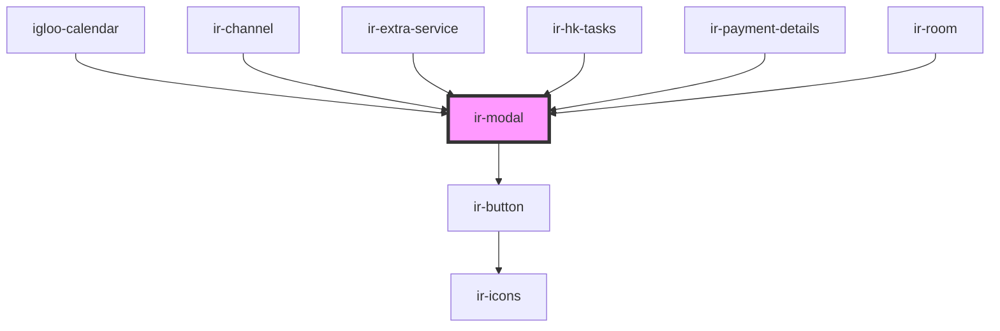

# ir-modal

<!-- Auto Generated Below -->

## Properties

| Property         | Attribute          | Description | Type                                                                                            | Default         |
| ---------------- | ------------------ | ----------- | ----------------------------------------------------------------------------------------------- | --------------- |
| `autoClose`      | `auto-close`       |             | `boolean`                                                                                       | `true`          |
| `btnPosition`    | `btn-position`     |             | `"center" \| "left" \| "right"`                                                                 | `'right'`       |
| `icon`           | `icon`             |             | `string`                                                                                        | `''`            |
| `iconAvailable`  | `icon-available`   |             | `boolean`                                                                                       | `false`         |
| `isLoading`      | `is-loading`       |             | `boolean`                                                                                       | `false`         |
| `item`           | `item`             |             | `any`                                                                                           | `{}`            |
| `leftBtnActive`  | `left-btn-active`  |             | `boolean`                                                                                       | `true`          |
| `leftBtnColor`   | `left-btn-color`   |             | `"danger" \| "dark" \| "info" \| "light" \| "primary" \| "secondary" \| "success" \| "warning"` | `'secondary'`   |
| `leftBtnText`    | `left-btn-text`    |             | `string`                                                                                        | `'Close'`       |
| `modalBody`      | `modal-body`       |             | `string`                                                                                        | `'Modal Body'`  |
| `modalTitle`     | `modal-title`      |             | `string`                                                                                        | `'Modal Title'` |
| `rightBtnActive` | `right-btn-active` |             | `boolean`                                                                                       | `true`          |
| `rightBtnColor`  | `right-btn-color`  |             | `"danger" \| "dark" \| "info" \| "light" \| "primary" \| "secondary" \| "success" \| "warning"` | `'primary'`     |
| `rightBtnText`   | `right-btn-text`   |             | `string`                                                                                        | `'Confirm'`     |

## Events

| Event          | Description | Type               |
| -------------- | ----------- | ------------------ |
| `cancelModal`  |             | `CustomEvent<any>` |
| `confirmModal` |             | `CustomEvent<any>` |

## Methods

### `closeModal() => Promise<void>`

#### Returns

Type: `Promise<void>`

### `openModal() => Promise<void>`

#### Returns

Type: `Promise<void>`

## Dependencies

### Used by

 - [igloo-calendar](../igloo-calendar)
 - [ir-channel](../ir-channel)
 - [ir-extra-service](../ir-booking-details/ir-extra-services/ir-extra-service)
 - [ir-hk-tasks](../ir-housekeeping/ir-hk-tasks)
 - [ir-payment-details](../ir-booking-details/ir-payment-details)
 - [ir-room](../ir-booking-details/ir-room)

### Depends on

- [ir-button](../ir-button)

### Graph

----------------------------------------------

*Built with [StencilJS](https://stenciljs.com/)*
