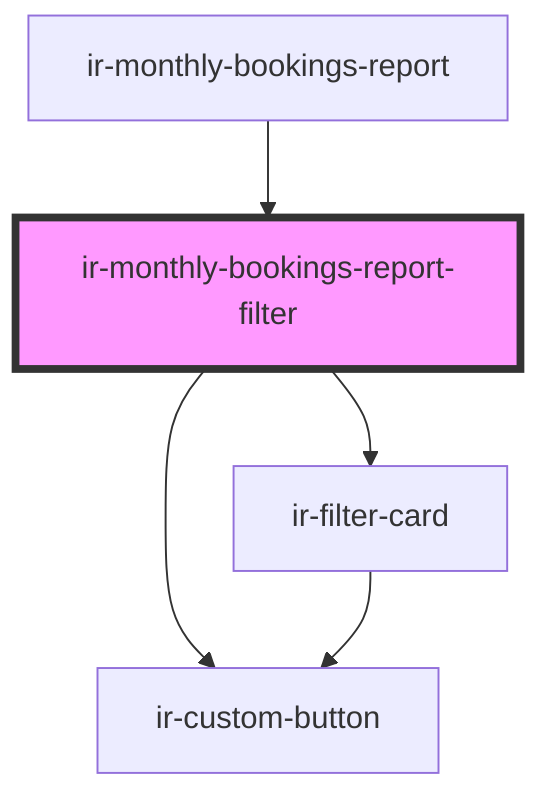

# ir-monthly-bookings-report-filter

<!-- Auto Generated Below -->

## Properties

| Property      | Attribute    | Description | Type                                                    | Default     |
| ------------- | ------------ | ----------- | ------------------------------------------------------- | ----------- |
| `baseFilters` | --           |             | `{ date: ReportDate; include_previous_year: boolean; }` | `undefined` |
| `isLoading`   | `is-loading` |             | `boolean`                                               | `undefined` |

## Events

| Event          | Description | Type                                                                 |
| -------------- | ----------- | -------------------------------------------------------------------- |
| `applyFilters` |             | `CustomEvent<{ date: ReportDate; include_previous_year: boolean; }>` |

## Dependencies

### Used by

 - [ir-monthly-bookings-report](..)

### Depends on

- [ir-filter-card](../../ir-filter-card)
- [ir-custom-button](../../ui/ir-custom-button)

### Graph

```mermaid
graph TD;
  ir-monthly-bookings-report-filter --> ir-filter-card
  ir-monthly-bookings-report-filter --> ir-custom-button
  ir-filter-card --> ir-custom-button
  ir-monthly-bookings-report --> ir-monthly-bookings-report-filter
  style ir-monthly-bookings-report-filter fill:#f9f,stroke:#333,stroke-width:4px
```

----------------------------------------------

*Built with [StencilJS](https://stenciljs.com/)*
