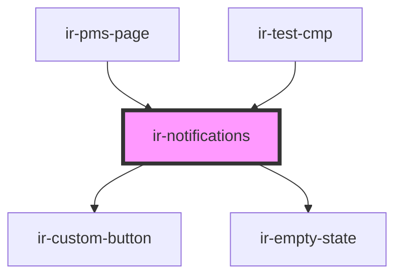

# ir-notifications

<!-- Auto Generated Below -->

## Properties

| Property     | Attribute    | Description | Type     | Default     |
| ------------ | ------------ | ----------- | -------- | ----------- |
| `propertyid` | `propertyid` |             | `number` | `undefined` |
| `ticket`     | `ticket`     |             | `string` | `undefined` |

## Events

| Event                 | Description | Type                                                                                                                                                                                                                                                                                                                                                                                                                                                                                                                                                                                                                                                                                                                 |
| --------------------- | ----------- | -------------------------------------------------------------------------------------------------------------------------------------------------------------------------------------------------------------------------------------------------------------------------------------------------------------------------------------------------------------------------------------------------------------------------------------------------------------------------------------------------------------------------------------------------------------------------------------------------------------------------------------------------------------------------------------------------------------------- |
| `notificationCleared` |             | `CustomEvent<Readonly<{ id: string; title: string; message: string; date: string; hour: number; minute: number; read?: boolean; dismissible?: boolean; autoDismissMs?: number; icon?: string; link?: NotificationLink; actions?: readonly NotificationAction[]; meta?: Record<string, unknown>; }> & { type: "error" \| "warning" \| "alert"; ariaRole?: "alert"; } \| Readonly<{ id: string; title: string; message: string; date: string; hour: number; minute: number; read?: boolean; dismissible?: boolean; autoDismissMs?: number; icon?: string; link?: NotificationLink; actions?: readonly NotificationAction[]; meta?: Record<string, unknown>; }> & { type: "success" \| "info"; ariaRole?: "status"; }>` |

## Dependencies

### Used by

 - [ir-pms-page](../pms-header/ir-pms-page)
 - [ir-test-cmp](../ir-test-cmp)

### Depends on

- [ir-custom-button](../ui/ir-custom-button)
- [ir-empty-state](../ir-empty-state)

### Graph

----------------------------------------------

*Built with [StencilJS](https://stenciljs.com/)*
