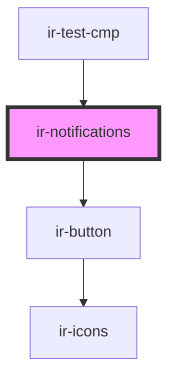

# ir-notifications

<!-- Auto Generated Below -->

## Properties

| Property        | Attribute | Description | Type             | Default |
| --------------- | --------- | ----------- | ---------------- | ------- |
| `notifications` | --        |             | `Notification[]` | `[]`    |

## Events

| Event                 | Description | Type                                                                                                                                                                                                                                                                                                                                                                                                                                                                                                                                                                                                                                                               |
| --------------------- | ----------- | ------------------------------------------------------------------------------------------------------------------------------------------------------------------------------------------------------------------------------------------------------------------------------------------------------------------------------------------------------------------------------------------------------------------------------------------------------------------------------------------------------------------------------------------------------------------------------------------------------------------------------------------------------------------ |
| `notificationCleared` |             | `CustomEvent<Readonly<{ id: string; title: string; message: string; createdAt: number; read?: boolean; dismissible?: boolean; autoDismissMs?: number; icon?: string; link?: NotificationLink; actions?: readonly NotificationAction[]; meta?: Record<string, unknown>; }> & { type: "error" \| "warning" \| "alert"; ariaRole?: "alert"; } \| Readonly<{ id: string; title: string; message: string; createdAt: number; read?: boolean; dismissible?: boolean; autoDismissMs?: number; icon?: string; link?: NotificationLink; actions?: readonly NotificationAction[]; meta?: Record<string, unknown>; }> & { type: "success" \| "info"; ariaRole?: "status"; }>` |

## Dependencies

### Used by

 - [ir-test-cmp](../ir-test-cmp)

### Depends on

- [ir-button](../ui/ir-button)

### Graph

----------------------------------------------

*Built with [StencilJS](https://stenciljs.com/)*
