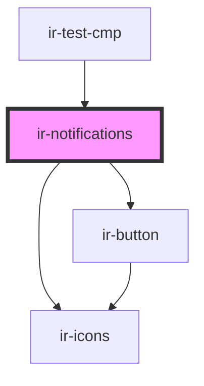

# ir-notifications

<!-- Auto Generated Below -->

## Properties

| Property            | Attribute            | Description | Type     | Default |
| ------------------- | -------------------- | ----------- | -------- | ------- |
| `notificationCount` | `notification-count` |             | `number` | `2`     |

## Dependencies

### Used by

 - [ir-test-cmp](../ir-test-cmp)

### Depends on

- [ir-button](../ui/ir-button)
- [ir-icons](../ui/ir-icons)

### Graph

----------------------------------------------

*Built with [StencilJS](https://stenciljs.com/)*
