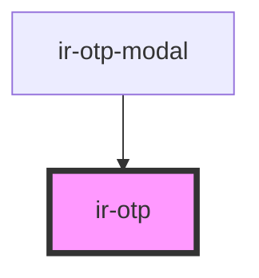

# ir-otp

<!-- Auto Generated Below -->

## Properties

| Property       | Attribute       | Description                                                | Type                                        | Default     |
| -------------- | --------------- | ---------------------------------------------------------- | ------------------------------------------- | ----------- |
| `autoFocus`    | `auto-focus`    | Auto focus on the first input when component loads         | `boolean`                                   | `true`      |
| `defaultValue` | `default-value` | The default OTP code                                       | `string`                                    | `undefined` |
| `disabled`     | `disabled`      | Whether the input is disabled                              | `boolean`                                   | `false`     |
| `length`       | `length`        | The length of the OTP code                                 | `number`                                    | `6`         |
| `numbersOnly`  | `numbers-only`  | Allow only numbers (0-9) as input                          | `boolean`                                   | `false`     |
| `placeholder`  | `placeholder`   | Placeholder character to display                           | `string`                                    | `''`        |
| `secure`       | `secure`        | Whether to mask the input (show dots instead of text)      | `boolean`                                   | `false`     |
| `type`         | `type`          | Input type - can be 'text', 'password', 'number', or 'tel' | `"number" \| "password" \| "tel" \| "text"` | `'number'`  |

## Events

| Event         | Description                              | Type                  |
| ------------- | ---------------------------------------- | --------------------- |
| `otpChange`   | Event emitted when the OTP value changes | `CustomEvent<string>` |
| `otpComplete` | Event emitted when the OTP is complete   | `CustomEvent<string>` |

## Dependencies

### Used by

 - [ir-otp-modal](..)

### Graph

----------------------------------------------

*Built with [StencilJS](https://stenciljs.com/)*
