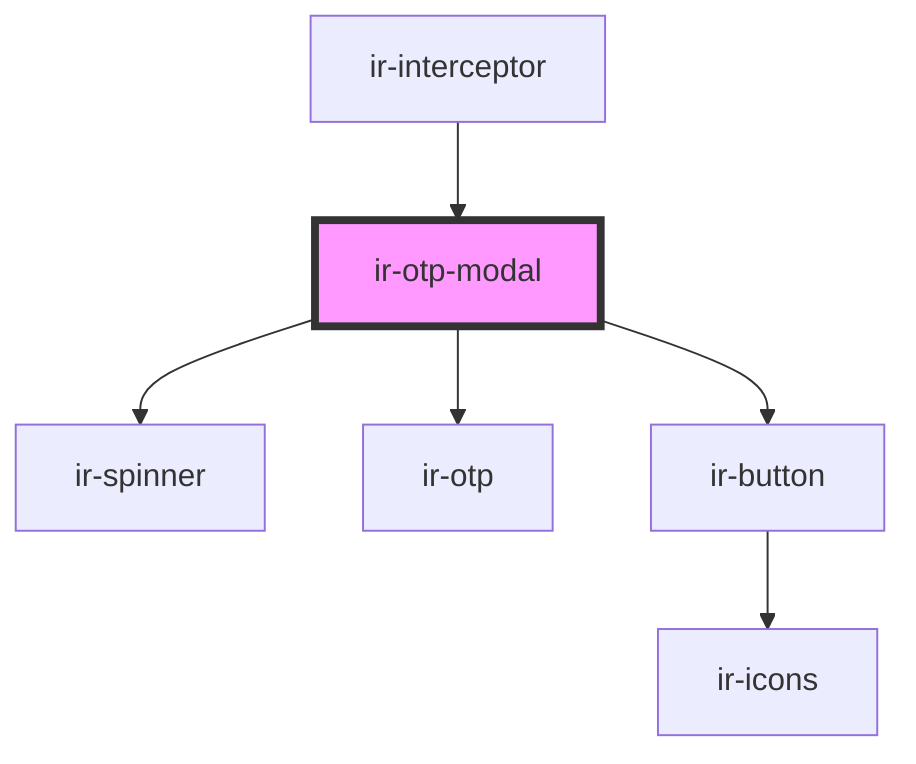

# ir-otp-modal

<!-- Auto Generated Below -->

## Properties

| Property      | Attribute        | Description                                                      | Type      | Default     |
| ------------- | ---------------- | ---------------------------------------------------------------- | --------- | ----------- |
| `baseOTPUrl`  | `base-o-t-p-url` | URL or endpoint used to validate the OTP                         | `string`  | `undefined` |
| `email`       | `email`          | User's email address to display in the modal and send the OTP to | `string`  | `undefined` |
| `language`    | `language`       |                                                                  | `string`  | `'en'`      |
| `otpLength`   | `otp-length`     | Number of digits the OTP should have                             | `number`  | `6`         |
| `requestUrl`  | `request-url`    | URL or endpoint used to validate the OTP                         | `string`  | `undefined` |
| `resendTimer` | `resend-timer`   | Number of seconds to wait before allowing OTP resend             | `number`  | `60`        |
| `showResend`  | `show-resend`    | Whether the resend option should be visible                      | `boolean` | `true`      |
| `ticket`      | `ticket`         | ticket for verifying and resending the verification code         | `string`  | `undefined` |

## Events

| Event         | Description                              | Type                                                            |
| ------------- | ---------------------------------------- | --------------------------------------------------------------- |
| `otpFinished` | Emits the final OTP (or empty on cancel) | `CustomEvent<{ otp: string; type: "success" \| "cancelled"; }>` |

## Methods

### `closeModal() => Promise<void>`

Hide & clear timer

#### Returns

Type: `Promise<void>`

### `openModal() => Promise<void>`

Open & reset everything

#### Returns

Type: `Promise<void>`

## Dependencies

### Used by

 - [ir-interceptor](../ir-interceptor)

### Depends on

- [ir-spinner](../ui/ir-spinner)
- [ir-otp](ir-otp)
- [ir-button](../ui/ir-button)

### Graph

----------------------------------------------

*Built with [StencilJS](https://stenciljs.com/)*
