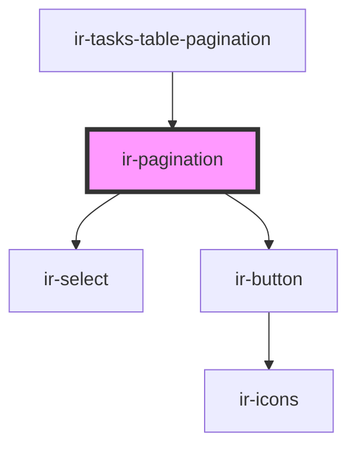

# ir-pagination

<!-- Auto Generated Below -->

## Properties

| Property              | Attribute                | Description                                                                                                                                                                                                                                                                                                                                 | Type              | Default              |
| --------------------- | ------------------------ | ------------------------------------------------------------------------------------------------------------------------------------------------------------------------------------------------------------------------------------------------------------------------------------------------------------------------------------------- | ----------------- | -------------------- |
| `allowPageSizeChange` | `allow-page-size-change` | Enables a dropdown for changing the number of items displayed per page.  When set to `true`, users can select a page size from the `pageSizes` array.  **Note:** This prop requires the `pageSizes` prop to be defined with one or more numeric values. If `pageSizes` is empty or undefined, the page size selector will not be displayed. | `boolean`         | `undefined`          |
| `currentPage`         | `current-page`           | Current active page number (1-based)                                                                                                                                                                                                                                                                                                        | `number`          | `1`                  |
| `disabled`            | `disabled`               | Whether the pagination is disabled                                                                                                                                                                                                                                                                                                          | `boolean`         | `false`              |
| `pageSize`            | `page-size`              | Page size for calculations                                                                                                                                                                                                                                                                                                                  | `number`          | `10`                 |
| `pageSizes`           | --                       | List of all page size                                                                                                                                                                                                                                                                                                                       | `number[]`        | `undefined`          |
| `pages`               | `pages`                  | Total number of pages available                                                                                                                                                                                                                                                                                                             | `number`          | `0`                  |
| `recordLabel`         | `record-label`           | Label for the record type (e.g., 'items', 'tasks', 'records')                                                                                                                                                                                                                                                                               | `string`          | `''`                 |
| `showTotalRecords`    | `show-total-records`     | Whether to show total records count                                                                                                                                                                                                                                                                                                         | `boolean`         | `true`               |
| `showing`             | --                       | Range of items currently being displayed                                                                                                                                                                                                                                                                                                    | `PaginationRange` | `{ from: 0, to: 0 }` |
| `total`               | `total`                  | Total number of records/items                                                                                                                                                                                                                                                                                                               | `number`          | `0`                  |

## Events

| Event            | Description                                 | Type                                 |
| ---------------- | ------------------------------------------- | ------------------------------------ |
| `firstPage`      | Emitted when the first page is requested    | `CustomEvent<PaginationChangeEvent>` |
| `lastPage`       | Emitted when the last page is requested     | `CustomEvent<PaginationChangeEvent>` |
| `nextPage`       | Emitted when the next page is requested     | `CustomEvent<PaginationChangeEvent>` |
| `pageChange`     | Emitted when the current page changes       | `CustomEvent<PaginationChangeEvent>` |
| `pageSizeChange` | Emitted when the page size changes          | `CustomEvent<PaginationChangeEvent>` |
| `previousPage`   | Emitted when the previous page is requested | `CustomEvent<PaginationChangeEvent>` |

## Dependencies

### Used by

 - [ir-tasks-table-pagination](../ir-housekeeping/ir-hk-tasks/ir-tasks-table/ir-tasks-table-pagination)

### Depends on

- [ir-select](../ui/ir-select)
- [ir-button](../ui/ir-button)

### Graph

----------------------------------------------

*Built with [StencilJS](https://stenciljs.com/)*
