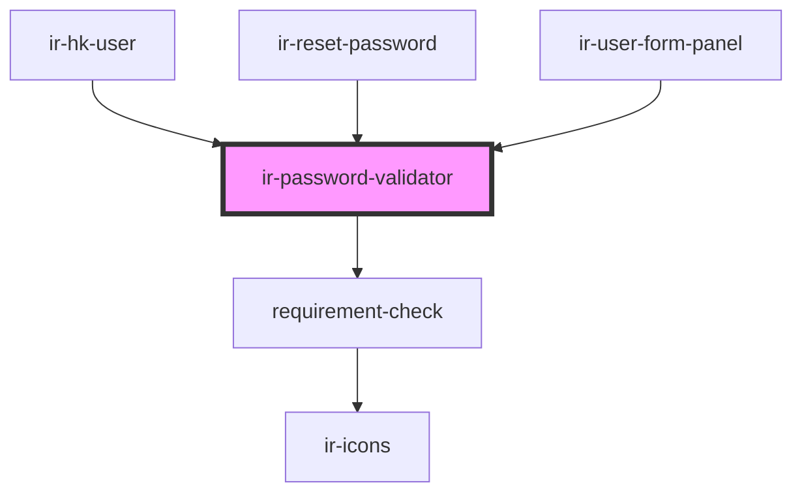

# ir-password-validator

<!-- Auto Generated Below -->

## Properties

| Property   | Attribute  | Description                     | Type     | Default |
| ---------- | ---------- | ------------------------------- | -------- | ------- |
| `password` | `password` | The password string to validate | `string` | `''`    |

## Events

| Event                      | Description | Type                   |
| -------------------------- | ----------- | ---------------------- |
| `passwordValidationChange` |             | `CustomEvent<boolean>` |

## Dependencies

### Used by

 - [ir-hk-user](../ir-housekeeping/ir-hk-user)
 - [ir-reset-password](../ir-reset-password)
 - [ir-user-form-panel](../ir-user-management/ir-user-form-panel)

### Depends on

- [requirement-check](requirement-check)

### Graph

----------------------------------------------

*Built with [StencilJS](https://stenciljs.com/)*
