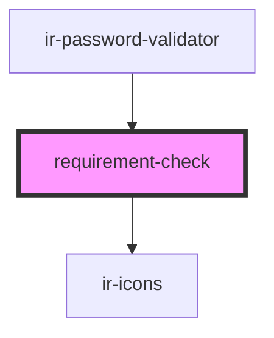

# requirement-check

<!-- Auto Generated Below -->

## Properties

| Property  | Attribute  | Description                                                             | Type      | Default |
| --------- | ---------- | ----------------------------------------------------------------------- | --------- | ------- |
| `isValid` | `is-valid` | Whether this requirement has been satisfied (true/false).               | `boolean` | `false` |
| `text`    | `text`     | The requirement text to display (e.g. "At least one lowercase letter"). | `string`  | `''`    |

## Dependencies

### Used by

 - [ir-password-validator](..)

### Depends on

- [ir-icons](../../ui/ir-icons)

### Graph

----------------------------------------------

*Built with [StencilJS](https://stenciljs.com/)*
