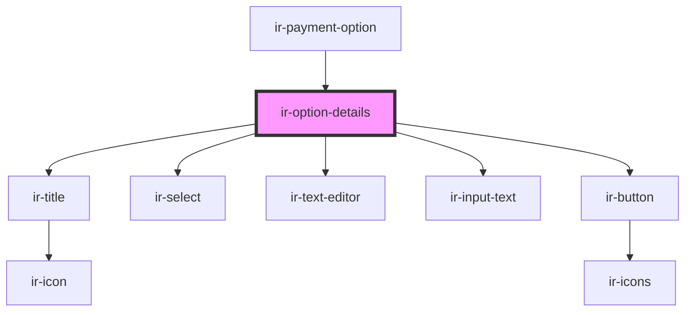

# ir-option-details

<!-- Auto Generated Below -->

## Properties

| Property     | Attribute     | Description | Type     | Default     |
| ------------ | ------------- | ----------- | -------- | ----------- |
| `propertyId` | `property-id` |             | `string` | `undefined` |

## Events

| Event        | Description | Type                                                                                                 |
| ------------ | ----------- | ---------------------------------------------------------------------------------------------------- |
| `closeModal` |             | `CustomEvent<PaymentOption>`                                                                         |
| `toast`      |             | `CustomEvent<ICustomToast & Partial<IToastWithButton> \| IDefaultToast & Partial<IToastWithButton>>` |

## Dependencies

### Used by

 - [ir-payment-option](..)

### Depends on

- [ir-title](../../ir-title)
- [ir-select](../../ui/ir-select)
- [ir-text-editor](../../ui/ir-text-editor)
- [ir-input-text](../../ui/ir-input-text)
- [ir-button](../../ui/ir-button)

### Graph

----------------------------------------------

*Built with [StencilJS](https://stenciljs.com/)*
