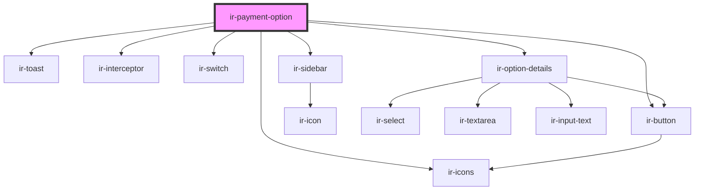

# ir-payment-option

<!-- Auto Generated Below -->

## Properties

| Property        | Attribute        | Description | Type      | Default     |
| --------------- | ---------------- | ----------- | --------- | ----------- |
| `baseurl`       | `baseurl`        |             | `string`  | `undefined` |
| `defaultStyles` | `default-styles` |             | `boolean` | `true`      |
| `language`      | `language`       |             | `string`  | `'en'`      |
| `propertyid`    | `propertyid`     |             | `string`  | `undefined` |
| `ticket`        | `ticket`         |             | `string`  | `undefined` |

## Dependencies

### Depends on

- [ir-toast](../ir-toast)
- [ir-interceptor](../ir-interceptor)
- [ir-icons](../ui/ir-icons)
- [ir-switch](../ir-switch)
- [ir-button](../ir-button)
- [ir-sidebar](../ir-sidebar)
- [ir-option-details](ir-option-details)

### Graph

----------------------------------------------

*Built with [StencilJS](https://stenciljs.com/)*
