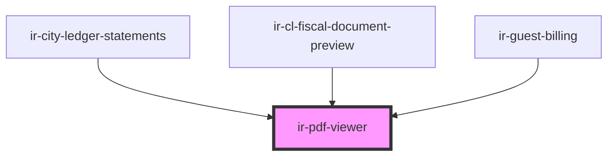

# ir-pdf-viewer

<!-- Auto Generated Below -->

## Properties

| Property    | Attribute    | Description                                                                              | Type     | Default     |
| ----------- | ------------ | ---------------------------------------------------------------------------------------- | -------- | ----------- |
| `src`       | `src`        | URL of the PDF to display                                                                | `string` | `undefined` |
| `workerSrc` | `worker-src` | Override the pdf.js worker URL (defaults to the bundled asset). Read once at first load. | `string` | `undefined` |

## Dependencies

### Used by

 - [ir-city-ledger-statements](../ir-city-ledger/ir-city-ledger-statements)
 - [ir-cl-fiscal-document-preview](../ir-city-ledger/ir-city-ledger-fiscal-documents/ir-cl-fiscal-document-preview)
 - [ir-guest-billing](../ir-billing/ir-guest-billing)

### Graph

----------------------------------------------

*Built with [StencilJS](https://stenciljs.com/)*
