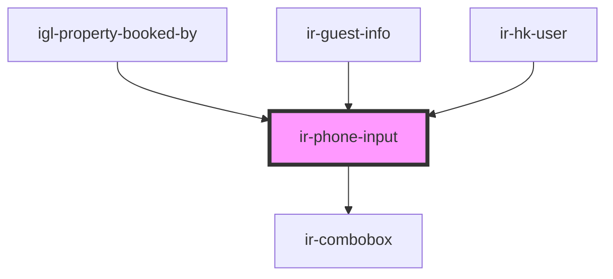

# ir-phone-input

<!-- Auto Generated Below -->

## Properties

| Property          | Attribute         | Description | Type         | Default     |
| ----------------- | ----------------- | ----------- | ------------ | ----------- |
| `countries`       | --                |             | `ICountry[]` | `[]`        |
| `default_country` | `default_country` |             | `number`     | `null`      |
| `disabled`        | `disabled`        |             | `boolean`    | `false`     |
| `error`           | `error`           |             | `boolean`    | `false`     |
| `label`           | `label`           |             | `string`     | `undefined` |
| `language`        | `language`        |             | `string`     | `undefined` |
| `phone_prefix`    | `phone_prefix`    |             | `string`     | `null`      |
| `placeholder`     | `placeholder`     |             | `string`     | `undefined` |
| `token`           | `token`           |             | `string`     | `undefined` |
| `value`           | `value`           |             | `string`     | `''`        |

## Events

| Event        | Description | Type                                                     |
| ------------ | ----------- | -------------------------------------------------------- |
| `textChange` |             | `CustomEvent<{ phone_prefix: string; mobile: string; }>` |

## Dependencies

### Used by

 - [igl-property-booked-by](../igloo-calendar/igl-book-property/igl-booking-form/igl-property-booked-by)
 - [ir-guest-info](../ir-guest-info)
 - [ir-hk-user](../ir-housekeeping/ir-hk-user)

### Depends on

- [ir-combobox](../ir-combobox)

### Graph

----------------------------------------------

*Built with [StencilJS](https://stenciljs.com/)*
