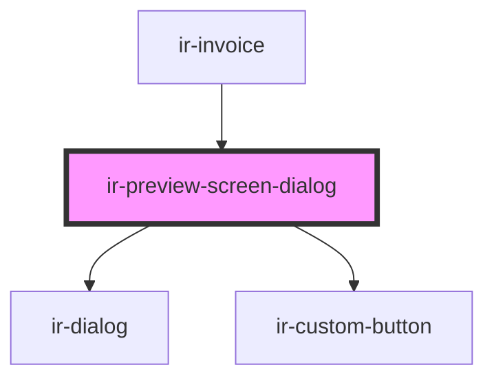

# ir-preview-screen-dialog

<!-- Auto Generated Below -->

## Properties

| Property            | Attribute             | Description                                                                                                                                       | Type                    | Default     |
| ------------------- | --------------------- | ------------------------------------------------------------------------------------------------------------------------------------------------- | ----------------------- | ----------- |
| `action`            | `action`              | Determines which built-in action is rendered in the header. `print` triggers `window.print()` while `download` downloads the configured URL.      | `"download" \| "print"` | `'print'`   |
| `actionButtonLabel` | `action-button-label` | Accessible label used for the default header action button. Falls back to context-sensitive defaults when omitted.                                | `string`                | `undefined` |
| `downloadFileName`  | `download-file-name`  | Suggested file name for downloaded previews.                                                                                                      | `string`                | `undefined` |
| `downloadUrl`       | `download-url`        | URL used when the action is set to `download`. Can be overridden per invocation via {@link triggerAction}.                                        | `string`                | `undefined` |
| `hideDefaultAction` | `hide-default-action` | When `true`, hides the default header action button so a custom implementation can be slotted.                                                    | `boolean`               | `false`     |
| `label`             | `label`               | The dialog's label as displayed in the header. Required for accessibility and announced by assistive technologies.                                | `string`                | `'Preview'` |
| `open`              | `open`                | Indicates whether or not the preview dialog is open. Toggle this attribute or use {@link openDialog} / {@link closeDialog} to control visibility. | `boolean`               | `false`     |

## Events

| Event           | Description                                                                                      | Type                                                    |
| --------------- | ------------------------------------------------------------------------------------------------ | ------------------------------------------------------- |
| `openChanged`   |                                                                                                  | `CustomEvent<boolean>`                                  |
| `previewAction` | Fired whenever the preview action is executed, either via the header button or programmatically. | `CustomEvent<{ action: PreviewAction; url?: string; }>` |

## Methods

### `closeDialog() => Promise<void>`

Closes the preview dialog.

#### Returns

Type: `Promise<void>`

### `openDialog() => Promise<void>`

Opens the preview dialog.

#### Returns

Type: `Promise<void>`

### `triggerAction(action?: PreviewAction, url?: string, fileName?: string) => Promise<boolean>`

Executes the configured preview action.

#### Parameters

| Name       | Type                    | Description                                                            |
| ---------- | ----------------------- | ---------------------------------------------------------------------- |
| `action`   | `"print" \| "download"` | Optional override of the default action type.                          |
| `url`      | `string`                | Optional URL used for downloads. Falls back to the `downloadUrl` prop. |
| `fileName` | `string`                | Optional file name suggestion for downloads.                           |

#### Returns

Type: `Promise<boolean>`

Resolves with `true` when the action was attempted, `false` when prerequisites are missing.

## Dependencies

### Used by

 - [ir-invoice](../ir-invoice)

### Depends on

- [ir-dialog](../ui/ir-dialog)
- [ir-custom-button](../ui/ir-custom-button)

### Graph

----------------------------------------------

*Built with [StencilJS](https://stenciljs.com/)*
