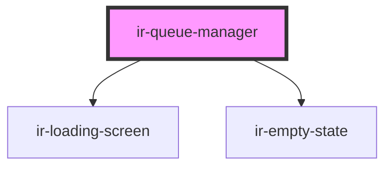

# ir-queue-manager

<!-- Auto Generated Below -->

## Properties

| Property | Attribute | Description | Type     | Default |
| -------- | --------- | ----------- | -------- | ------- |
| `ticket` | `ticket`  |             | `string` | `''`    |

## Dependencies

### Depends on

- [ir-loading-screen](../ir-loading-screen)
- [ir-empty-state](../ir-empty-state)

### Graph

----------------------------------------------

*Built with [StencilJS](https://stenciljs.com/)*
