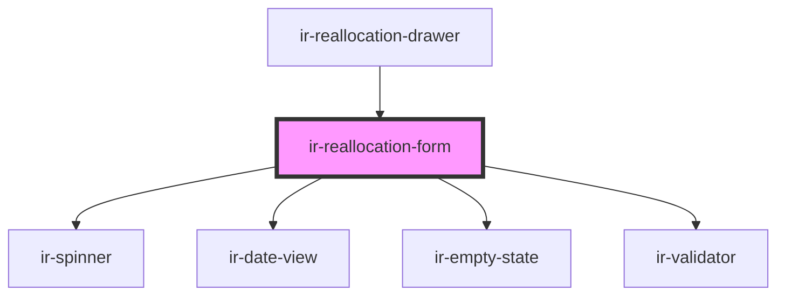

# ir-reallocation-form

<!-- Auto Generated Below -->

## Properties

| Property     | Attribute    | Description | Type      | Default     |
| ------------ | ------------ | ----------- | --------- | ----------- |
| `booking`    | --           |             | `Booking` | `undefined` |
| `formId`     | `form-id`    |             | `string`  | `undefined` |
| `identifier` | `identifier` |             | `string`  | `undefined` |
| `pool`       | `pool`       |             | `string`  | `undefined` |

## Events

| Event        | Description | Type                |
| ------------ | ----------- | ------------------- |
| `closeModal` |             | `CustomEvent<null>` |

## Dependencies

### Used by

 - [ir-reallocation-drawer](..)

### Depends on

- [ir-spinner](../../ui/ir-spinner)
- [ir-date-view](../../ir-date-view)
- [ir-empty-state](../../ir-empty-state)
- [ir-validator](../../ui/ir-validator)

### Graph

----------------------------------------------

*Built with [StencilJS](https://stenciljs.com/)*
