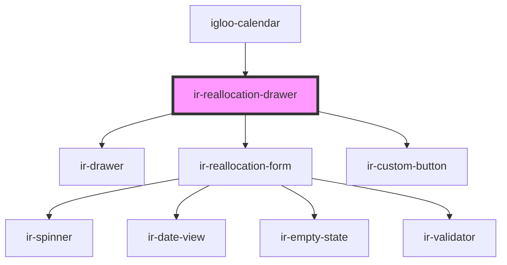

# ir-reallocation-drawer

<!-- Auto Generated Below -->

## Properties

| Property         | Attribute         | Description | Type      | Default     |
| ---------------- | ----------------- | ----------- | --------- | ----------- |
| `booking`        | --                |             | `Booking` | `undefined` |
| `open`           | `open`            |             | `boolean` | `undefined` |
| `pool`           | `pool`            |             | `string`  | `undefined` |
| `roomIdentifier` | `room-identifier` |             | `string`  | `undefined` |

## Events

| Event        | Description | Type                |
| ------------ | ----------- | ------------------- |
| `closeModal` |             | `CustomEvent<void>` |

## Dependencies

### Used by

 - [igloo-calendar](../igloo-calendar)

### Depends on

- [ir-drawer](../ir-drawer)
- [ir-reallocation-form](ir-reallocation-form)
- [ir-custom-button](../ui/ir-custom-button)

### Graph

----------------------------------------------

*Built with [StencilJS](https://stenciljs.com/)*
