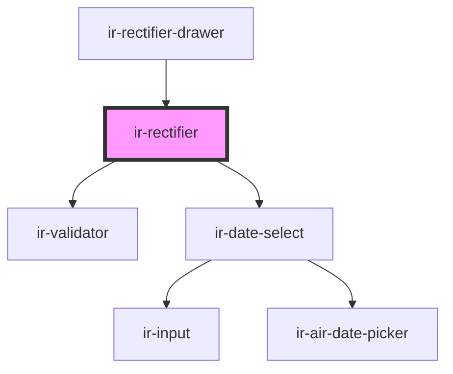

# ir-rectifier

<!-- Auto Generated Below -->

## Properties

| Property | Attribute | Description | Type     | Default     |
| -------- | --------- | ----------- | -------- | ----------- |
| `formId` | `form-id` |             | `string` | `undefined` |

## Events

| Event            | Description | Type                   |
| ---------------- | ----------- | ---------------------- |
| `closeDrawer`    |             | `CustomEvent<void>`    |
| `loadingChanged` |             | `CustomEvent<boolean>` |

## Dependencies

### Used by

 - [ir-rectifier-drawer](..)

### Depends on

- [ir-validator](../../ui/ir-validator)
- [ir-date-select](../../ui/date-picker/ir-date-select)

### Graph

----------------------------------------------

*Built with [StencilJS](https://stenciljs.com/)*
