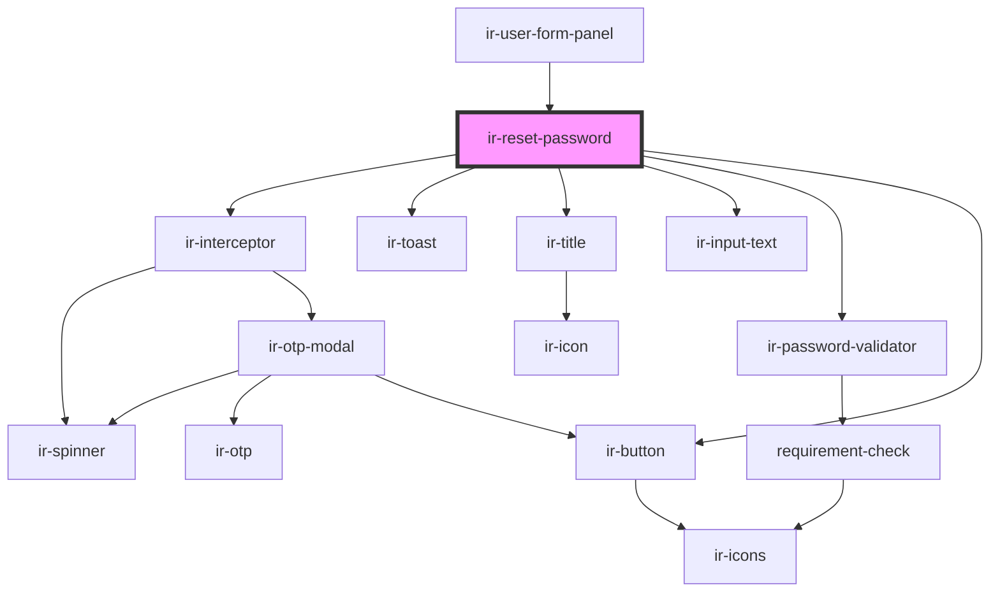

# ir-reset-password

<!-- Auto Generated Below -->

## Properties

| Property   | Attribute   | Description | Type      | Default     |
| ---------- | ----------- | ----------- | --------- | ----------- |
| `language` | `language`  |             | `string`  | `'en'`      |
| `old_pwd`  | `old_pwd`   |             | `string`  | `undefined` |
| `skip2Fa`  | `skip-2-fa` |             | `boolean` | `undefined` |
| `ticket`   | `ticket`    |             | `string`  | `undefined` |
| `username` | `username`  |             | `string`  | `undefined` |

## Events

| Event          | Description | Type                |
| -------------- | ----------- | ------------------- |
| `closeSideBar` |             | `CustomEvent<null>` |

## Dependencies

### Used by

 - [ir-user-form-panel](../ir-user-management/ir-user-form-panel)

### Depends on

- [ir-interceptor](../ir-interceptor)
- [ir-toast](../ui/ir-toast)
- [ir-title](../ir-title)
- [ir-input-text](../ui/ir-input-text)
- [ir-password-validator](../ir-password-validator)
- [ir-button](../ui/ir-button)

### Graph

----------------------------------------------

*Built with [StencilJS](https://stenciljs.com/)*
