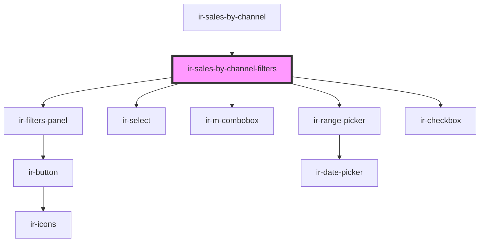

# ir-sales-by-channel-filters

<!-- Auto Generated Below -->

## Properties

| Property            | Attribute    | Description | Type                                                                                                                                                                                   | Default     |
| ------------------- | ------------ | ----------- | -------------------------------------------------------------------------------------------------------------------------------------------------------------------------------------- | ----------- |
| `allowedProperties` | --           |             | `{ name?: string; id?: number; }[]`                                                                                                                                                    | `undefined` |
| `baseFilters`       | --           |             | `{ FROM_DATE?: string; TO_DATE?: string; AC_ID?: string; BOOK_CASE?: string; WINDOW?: number; is_export_to_excel?: boolean; LIST_AC_ID?: number[]; include_previous_year?: boolean; }` | `undefined` |
| `isLoading`         | `is-loading` |             | `boolean`                                                                                                                                                                              | `undefined` |

## Events

| Event          | Description | Type                                                                                                                                                                                                |
| -------------- | ----------- | --------------------------------------------------------------------------------------------------------------------------------------------------------------------------------------------------- |
| `applyFilters` |             | `CustomEvent<{ FROM_DATE?: string; TO_DATE?: string; AC_ID?: string; BOOK_CASE?: string; WINDOW?: number; is_export_to_excel?: boolean; LIST_AC_ID?: number[]; include_previous_year?: boolean; }>` |

## Dependencies

### Used by

 - [ir-sales-by-channel](..)

### Depends on

- [ir-filters-panel](../../ui/ir-filters-panel)
- [ir-select](../../ui/ir-select)
- [ir-m-combobox](../../ir-m-combobox)
- [ir-range-picker](../../ir-housekeeping/ir-hk-tasks/ir-hk-archive/ir-range-picker)
- [ir-checkbox](../../ui/ir-checkbox)

### Graph

----------------------------------------------

*Built with [StencilJS](https://stenciljs.com/)*
