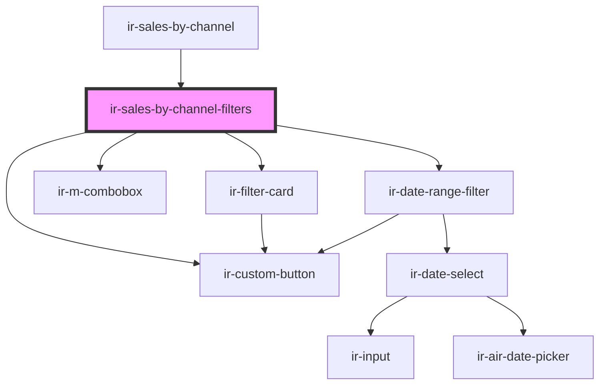

# ir-sales-by-channel-filters

<!-- Auto Generated Below -->

## Properties

| Property            | Attribute    | Description | Type                                                                                                                                                                                   | Default     |
| ------------------- | ------------ | ----------- | -------------------------------------------------------------------------------------------------------------------------------------------------------------------------------------- | ----------- |
| `allowedProperties` | --           |             | `{ name?: string; id?: number; }[]`                                                                                                                                                    | `undefined` |
| `baseFilters`       | --           |             | `{ AC_ID?: string; BOOK_CASE?: string; FROM_DATE?: string; TO_DATE?: string; WINDOW?: number; is_export_to_excel?: boolean; LIST_AC_ID?: number[]; include_previous_year?: boolean; }` | `undefined` |
| `isLoading`         | `is-loading` |             | `boolean`                                                                                                                                                                              | `undefined` |

## Events

| Event          | Description | Type                                                                                                                                                                                                |
| -------------- | ----------- | --------------------------------------------------------------------------------------------------------------------------------------------------------------------------------------------------- |
| `applyFilters` |             | `CustomEvent<{ AC_ID?: string; BOOK_CASE?: string; FROM_DATE?: string; TO_DATE?: string; WINDOW?: number; is_export_to_excel?: boolean; LIST_AC_ID?: number[]; include_previous_year?: boolean; }>` |

## Dependencies

### Used by

 - [ir-sales-by-channel](..)

### Depends on

- [ir-filter-card](../../ir-filter-card)
- [ir-m-combobox](../../ir-m-combobox)
- [ir-date-range-filter](../../ui/ir-date-range-filter)
- [ir-custom-button](../../ui/ir-custom-button)

### Graph

```mermaid
graph TD;
  ir-sales-by-channel-filters --> ir-filter-card
  ir-sales-by-channel-filters --> ir-m-combobox
  ir-sales-by-channel-filters --> ir-date-range-filter
  ir-sales-by-channel-filters --> ir-custom-button
  ir-filter-card --> ir-custom-button
  ir-date-range-filter --> ir-date-select
  ir-date-range-filter --> ir-custom-button
  ir-date-select --> ir-input
  ir-date-select --> ir-air-date-picker
  ir-sales-by-channel --> ir-sales-by-channel-filters
  style ir-sales-by-channel-filters fill:#f9f,stroke:#333,stroke-width:4px
```

----------------------------------------------

*Built with [StencilJS](https://stenciljs.com/)*
