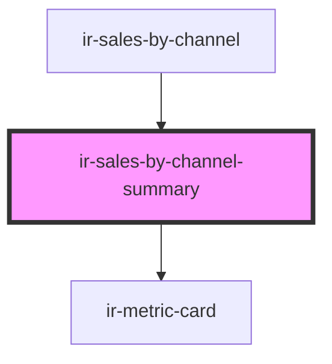

# ir-sales-by-channel-summary

<!-- Auto Generated Below -->

## Properties

| Property  | Attribute | Description | Type                                                                                                                                                                                                                                                                                           | Default |
| --------- | --------- | ----------- | ---------------------------------------------------------------------------------------------------------------------------------------------------------------------------------------------------------------------------------------------------------------------------------------------- | ------- |
| `records` | --        |             | `{ currency?: string; NIGHTS?: number; PCT?: number; REVENUE?: number; SOURCE?: string; PROPERTY_ID?: number; PROPERTY_NAME?: string; last_year?: { currency?: string; NIGHTS?: number; PCT?: number; REVENUE?: number; SOURCE?: string; PROPERTY_ID?: number; PROPERTY_NAME?: string; }; }[]` | `[]`    |

## Dependencies

### Used by

 - [ir-sales-by-channel](..)

### Depends on

- [ir-metric-card](../../ir-metric-card)

### Graph

----------------------------------------------

*Built with [StencilJS](https://stenciljs.com/)*
