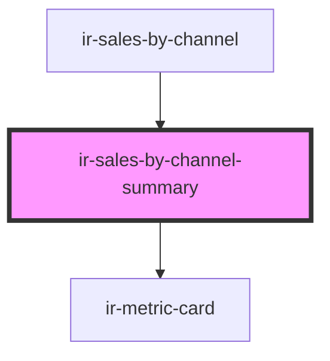

# ir-sales-by-channel-summary

<!-- Auto Generated Below -->

## Properties

| Property  | Attribute | Description | Type                                                                                                                                                                                                                                                                                                                                       | Default     |
| --------- | --------- | ----------- | ------------------------------------------------------------------------------------------------------------------------------------------------------------------------------------------------------------------------------------------------------------------------------------------------------------------------------------------ | ----------- |
| `filters` | --        |             | `{ AC_ID?: string; BOOK_CASE?: string; FROM_DATE?: string; TO_DATE?: string; WINDOW?: number; is_export_to_excel?: boolean; LIST_AC_ID?: number[]; include_previous_year?: boolean; }`                                                                                                                                                     | `undefined` |
| `records` | --        |             | `{ currency?: string; NIGHTS?: number; PCT?: number; REVENUE?: number; SOURCE?: string; PROPERTY_ID?: number; PROPERTY_NAME?: string; SOURCE_ICON?: string; last_year?: { currency?: string; NIGHTS?: number; PCT?: number; REVENUE?: number; SOURCE?: string; PROPERTY_ID?: number; PROPERTY_NAME?: string; SOURCE_ICON?: string; }; }[]` | `[]`        |

## Dependencies

### Used by

 - [ir-sales-by-channel](..)

### Depends on

- [ir-metric-card](../../ir-metric-card)

### Graph

----------------------------------------------

*Built with [StencilJS](https://stenciljs.com/)*
