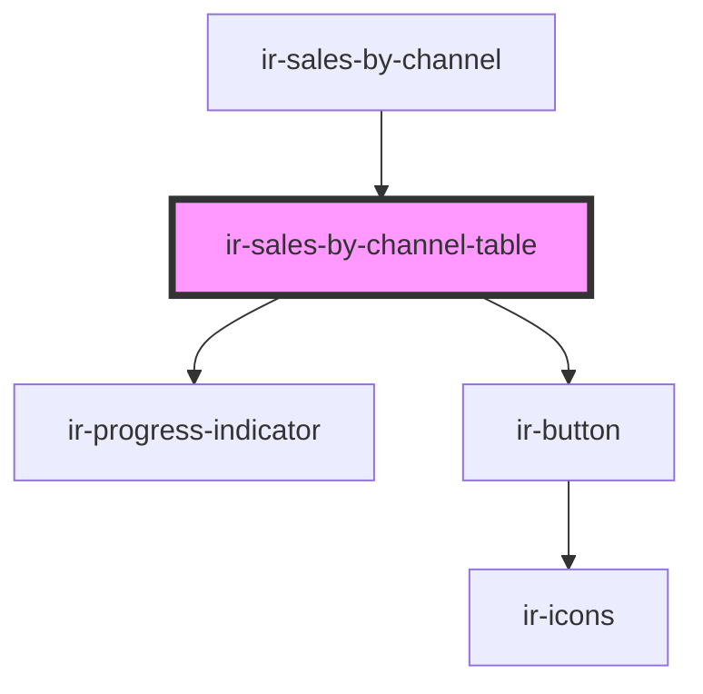

# ir-sales-by-channel-table

<!-- Auto Generated Below -->

## Properties

| Property            | Attribute | Description | Type                                                                                                                                                                                                                                                                                           | Default     |
| ------------------- | --------- | ----------- | ---------------------------------------------------------------------------------------------------------------------------------------------------------------------------------------------------------------------------------------------------------------------------------------------- | ----------- |
| `allowedProperties` | --        |             | `{ name?: string; id?: number; }[]`                                                                                                                                                                                                                                                            | `undefined` |
| `mode`              | `mode`    |             | `"mpo" \| "property"`                                                                                                                                                                                                                                                                          | `undefined` |
| `records`           | --        |             | `{ currency?: string; NIGHTS?: number; PCT?: number; REVENUE?: number; SOURCE?: string; PROPERTY_ID?: number; PROPERTY_NAME?: string; last_year?: { currency?: string; NIGHTS?: number; PCT?: number; REVENUE?: number; SOURCE?: string; PROPERTY_ID?: number; PROPERTY_NAME?: string; }; }[]` | `undefined` |

## Dependencies

### Used by

 - [ir-sales-by-channel](..)

### Depends on

- [ir-progress-indicator](../../ui/ir-progress-indicator)
- [ir-button](../../ui/ir-button)

### Graph

----------------------------------------------

*Built with [StencilJS](https://stenciljs.com/)*
