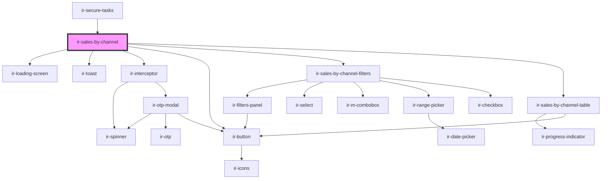

# ir-sales-by-channel

<!-- Auto Generated Below -->

## Properties

| Property     | Attribute    | Description | Type                  | Default     |
| ------------ | ------------ | ----------- | --------------------- | ----------- |
| `language`   | `language`   |             | `string`              | `''`        |
| `mode`       | `mode`       |             | `"mpo" \| "property"` | `undefined` |
| `p`          | `p`          |             | `string`              | `undefined` |
| `propertyid` | `propertyid` |             | `string`              | `undefined` |
| `ticket`     | `ticket`     |             | `string`              | `''`        |

## Dependencies

### Used by

 - [ir-secure-tasks](../ir-secure-tasks)

### Depends on

- [ir-loading-screen](../ir-loading-screen)
- [ir-toast](../ui/ir-toast)
- [ir-interceptor](../ir-interceptor)
- [ir-button](../ui/ir-button)
- [ir-sales-by-channel-filters](ir-sales-by-channel-filters)
- [ir-sales-by-channel-table](ir-sales-by-channel-table)

### Graph

----------------------------------------------

*Built with [StencilJS](https://stenciljs.com/)*
