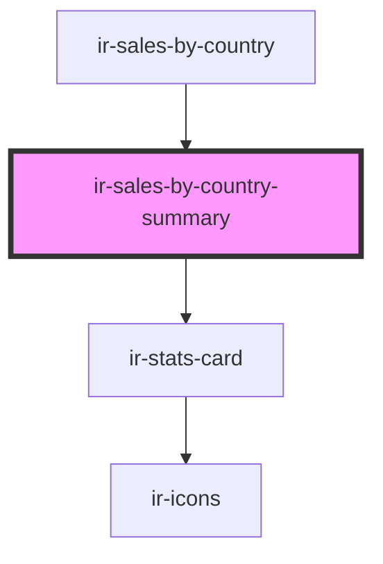

# ir-sales-by-country-summary

<!-- Auto Generated Below -->

## Properties

| Property       | Attribute | Description | Type            | Default     |
| -------------- | --------- | ----------- | --------------- | ----------- |
| `salesReports` | --        |             | `SalesRecord[]` | `undefined` |

## Dependencies

### Used by

 - [ir-sales-by-country](..)

### Depends on

- [ir-stats-card](../../ui/ir-stats-card)

### Graph

----------------------------------------------

*Built with [StencilJS](https://stenciljs.com/)*
