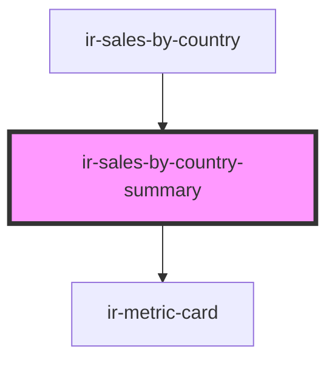

# ir-sales-by-country-summary

<!-- Auto Generated Below -->

## Properties

| Property       | Attribute | Description | Type                                                                                              | Default     |
| -------------- | --------- | ----------- | ------------------------------------------------------------------------------------------------- | ----------- |
| `filters`      | --        |             | `Omit<CountrySalesParams, "is_export_to_excel" \| "AC_ID"> & { include_previous_year: boolean; }` | `undefined` |
| `salesReports` | --        |             | `SalesRecord[]`                                                                                   | `undefined` |

## Dependencies

### Used by

 - [ir-sales-by-country](..)

### Depends on

- [ir-metric-card](../../ir-metric-card)

### Graph

```mermaid
graph TD;
  ir-sales-by-country-summary --> ir-metric-card
  ir-sales-by-country --> ir-sales-by-country-summary
  style ir-sales-by-country-summary fill:#f9f,stroke:#333,stroke-width:4px
```

----------------------------------------------

*Built with [StencilJS](https://stenciljs.com/)*
