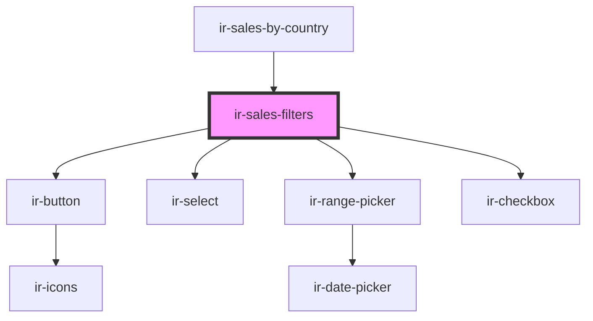

# ir-sales-filters

<!-- Auto Generated Below -->

## Properties

| Property    | Attribute    | Description | Type      | Default     |
| ----------- | ------------ | ----------- | --------- | ----------- |
| `isLoading` | `is-loading` |             | `boolean` | `undefined` |

## Events

| Event          | Description | Type                                                                                                                 |
| -------------- | ----------- | -------------------------------------------------------------------------------------------------------------------- |
| `applyFilters` |             | `CustomEvent<{ from_date: string; to_date: string; show_previous_year: boolean; rooms_status: { code: string; }; }>` |

## Dependencies

### Used by

 - [ir-sales-by-country](..)

### Depends on

- [ir-button](../../ui/ir-button)
- [ir-select](../../ui/ir-select)
- [ir-range-picker](../../ir-housekeeping/ir-hk-tasks/ir-hk-archive/ir-range-picker)
- [ir-checkbox](../../ui/ir-checkbox)

### Graph

----------------------------------------------

*Built with [StencilJS](https://stenciljs.com/)*
