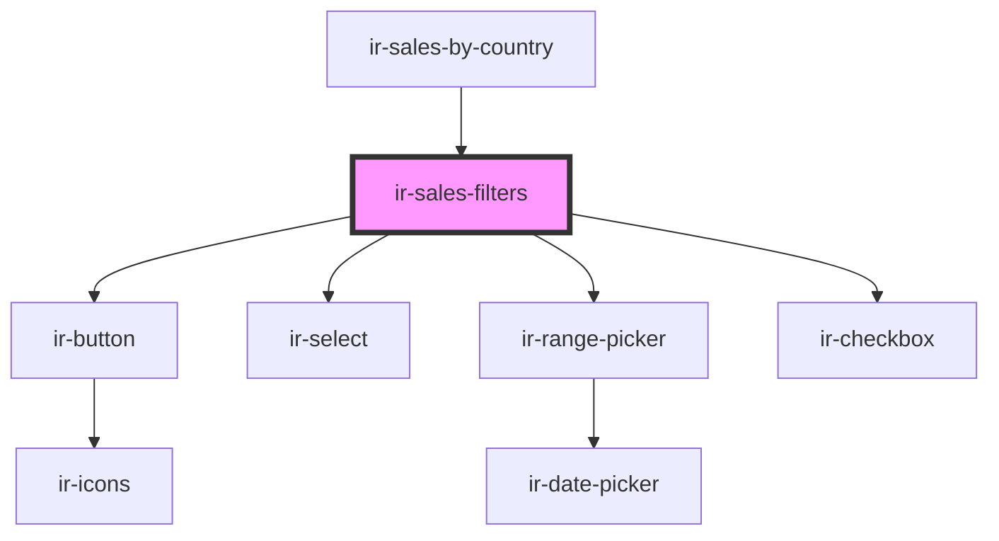

# ir-sales-filters

<!-- Auto Generated Below -->

## Properties

| Property      | Attribute    | Description | Type                                                                                              | Default     |
| ------------- | ------------ | ----------- | ------------------------------------------------------------------------------------------------- | ----------- |
| `baseFilters` | --           |             | `Omit<CountrySalesParams, "AC_ID" \| "is_export_to_excel"> & { include_previous_year: boolean; }` | `undefined` |
| `isLoading`   | `is-loading` |             | `boolean`                                                                                         | `undefined` |

## Events

| Event          | Description | Type                                                                                                           |
| -------------- | ----------- | -------------------------------------------------------------------------------------------------------------- |
| `applyFilters` |             | `CustomEvent<Omit<CountrySalesParams, "AC_ID" \| "is_export_to_excel"> & { include_previous_year: boolean; }>` |

## Dependencies

### Used by

 - [ir-sales-by-country](..)

### Depends on

- [ir-button](../../ui/ir-button)
- [ir-select](../../ui/ir-select)
- [ir-range-picker](../../ir-housekeeping/ir-hk-tasks/ir-hk-archive/ir-range-picker)
- [ir-checkbox](../../ui/ir-checkbox)

### Graph

----------------------------------------------

*Built with [StencilJS](https://stenciljs.com/)*
