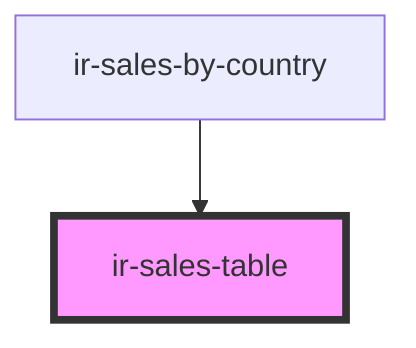

# ir-sales-table

<!-- Auto Generated Below -->

## Properties

| Property  | Attribute | Description | Type            | Default           |
| --------- | --------- | ----------- | --------------- | ----------------- |
| `records` | --        |             | `SalesRecord[]` | `sampleSalesData` |

## Dependencies

### Used by

 - [ir-sales-by-country](..)

### Graph

----------------------------------------------

*Built with [StencilJS](https://stenciljs.com/)*
