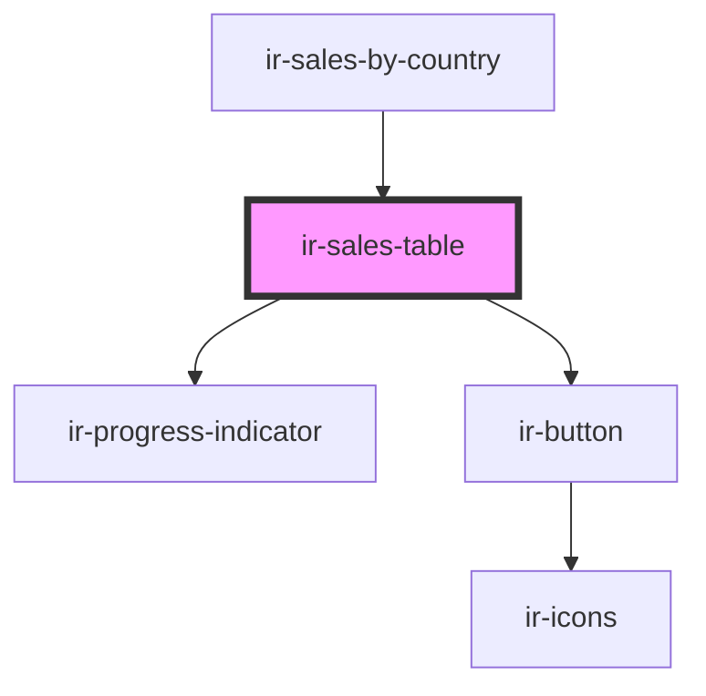

# ir-sales-table

<!-- Auto Generated Below -->

## Properties

| Property          | Attribute | Description | Type                                            | Default     |
| ----------------- | --------- | ----------- | ----------------------------------------------- | ----------- |
| `mappedCountries` | --        |             | `Map<number, Pick<ICountry, "name" \| "flag">>` | `undefined` |
| `records`         | --        |             | `SalesRecord[]`                                 | `[]`        |

## Dependencies

### Used by

 - [ir-sales-by-country](..)

### Depends on

- [ir-progress-indicator](../../ui/ir-progress-indicator)
- [ir-button](../../ui/ir-button)

### Graph

----------------------------------------------

*Built with [StencilJS](https://stenciljs.com/)*
