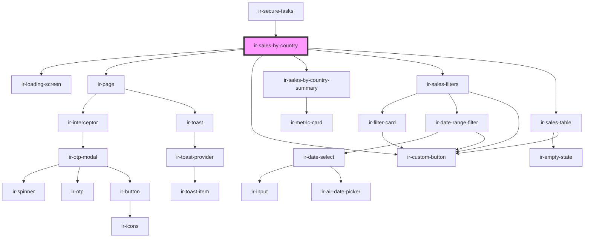

# ir-sales-by-country

<!-- Auto Generated Below -->

## Properties

| Property     | Attribute    | Description | Type     | Default     |
| ------------ | ------------ | ----------- | -------- | ----------- |
| `language`   | `language`   |             | `string` | `''`        |
| `p`          | `p`          |             | `string` | `undefined` |
| `propertyid` | `propertyid` |             | `number` | `undefined` |
| `ticket`     | `ticket`     |             | `string` | `''`        |

## Dependencies

### Used by

 - [ir-secure-tasks](../ir-secure-tasks)

### Depends on

- [ir-loading-screen](../ir-loading-screen)
- [ir-page](../ui/ir-page)
- [ir-custom-button](../ui/ir-custom-button)
- [ir-sales-by-country-summary](ir-sales-by-country-summary)
- [ir-sales-filters](ir-sales-filters)
- [ir-sales-table](ir-sales-table)

### Graph

```mermaid
graph TD;
  ir-sales-by-country --> ir-loading-screen
  ir-sales-by-country --> ir-page
  ir-sales-by-country --> ir-custom-button
  ir-sales-by-country --> ir-sales-by-country-summary
  ir-sales-by-country --> ir-sales-filters
  ir-sales-by-country --> ir-sales-table
  ir-page --> ir-interceptor
  ir-page --> ir-toast
  ir-interceptor --> ir-otp-modal
  ir-otp-modal --> ir-spinner
  ir-otp-modal --> ir-otp
  ir-otp-modal --> ir-button
  ir-button --> ir-icons
  ir-toast --> ir-toast-provider
  ir-toast-provider --> ir-toast-item
  ir-sales-by-country-summary --> ir-metric-card
  ir-sales-filters --> ir-filter-card
  ir-sales-filters --> ir-date-range-filter
  ir-sales-filters --> ir-custom-button
  ir-filter-card --> ir-custom-button
  ir-date-range-filter --> ir-date-select
  ir-date-range-filter --> ir-custom-button
  ir-date-select --> ir-input
  ir-date-select --> ir-air-date-picker
  ir-sales-table --> ir-empty-state
  ir-sales-table --> ir-custom-button
  ir-secure-tasks --> ir-sales-by-country
  style ir-sales-by-country fill:#f9f,stroke:#333,stroke-width:4px
```

----------------------------------------------

*Built with [StencilJS](https://stenciljs.com/)*
