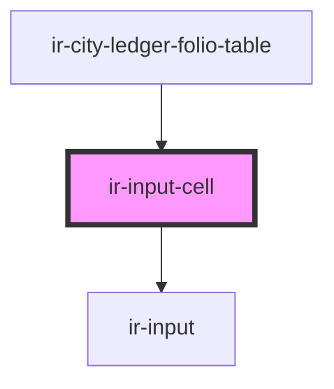

# ir-input-cell

<!-- Auto Generated Below -->

## Properties

| Property   | Attribute  | Description                         | Type                                                                        | Default     |
| ---------- | ---------- | ----------------------------------- | --------------------------------------------------------------------------- | ----------- |
| `disabled` | `disabled` | Disables the input.                 | `boolean`                                                                   | `undefined` |
| `mask`     | `mask`     | Mask for the input field (optional) | `MaskConfig<"email" \| "date" \| "price" \| "time" \| "url"> \| FactoryArg` | `undefined` |
| `value`    | `value`    | The value of the input.             | `string`                                                                    | `undefined` |

## Events

| Event             | Description | Type                  |
| ----------------- | ----------- | --------------------- |
| `cellValueChange` |             | `CustomEvent<string>` |

## Dependencies

### Used by

 - [ir-city-ledger-folio-table](../../ir-city-ledger/ir-city-ledger-folio/ir-city-ledger-folio-table)

### Depends on

- [ir-input](../../ui/ir-input)

### Graph

----------------------------------------------

*Built with [StencilJS](https://stenciljs.com/)*
