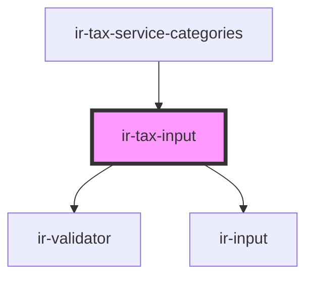

# ir-tax-input

<!-- Auto Generated Below -->

## Properties

| Property        | Attribute        | Description                                                                                                                                              | Type                                 | Default     |
| --------------- | ---------------- | -------------------------------------------------------------------------------------------------------------------------------------------------------- | ------------------------------------ | ----------- |
| `autoValidate`  | `auto-validate`  | Enables automatic validation behavior when true.                                                                                                         | `boolean`                            | `undefined` |
| `chargeRule`    | --               | Controlled charge rule value passed from the parent.  This represents the committed tax state and is used to sync the internal component state.          | `{ value?: number; mode?: string; }` | `undefined` |
| `inputDisabled` | `input-disabled` | Disables the percentage input when true.  Note: the input is also automatically disabled when the selected tax mode is "Not Applicable".                 | `boolean`                            | `undefined` |
| `label`         | `label`          | Label displayed above the percentage input.                                                                                                              | `string`                             | `undefined` |
| `language`      | `language`       | Current language used to resolve translated setup entry labels. Defaults to English ("en").                                                              | `string`                             | `'en'`      |
| `placeholder`   | `placeholder`    | Placeholder text shown in the percentage input.                                                                                                          | `string`                             | `undefined` |
| `setupEntries`  | --               | List of setup entries used to populate the tax mode select.  Each entry represents a tax application option (e.g. Not Applicable, Inclusive, Exclusive). | `IEntries[]`                         | `[]`        |

## Events

| Event       | Description                                                                                                                            | Type                                              |
| ----------- | -------------------------------------------------------------------------------------------------------------------------------------- | ------------------------------------------------- |
| `taxChange` | Emitted when the tax rule meaningfully changes.  Emission happens on: - input commit (IMask change / blur) - tax mode selection change | `CustomEvent<{ value?: number; mode?: string; }>` |

## Shadow Parts

| Part       | Description |
| ---------- | ----------- |
| `"input"`  |             |
| `"select"` |             |

## Dependencies

### Used by

 - [ir-tax-service-categories](..)

### Depends on

- [ir-validator](../../ui/ir-validator)
- [ir-input](../../ui/ir-input)

### Graph

----------------------------------------------

*Built with [StencilJS](https://stenciljs.com/)*
