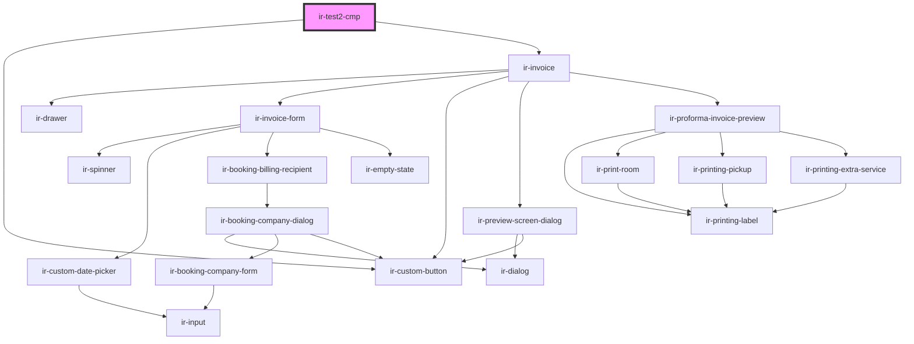

# ir-test-cmp

<!-- Auto Generated Below -->

## Dependencies

### Depends on

- [ir-custom-button](../ui/ir-custom-button)
- [ir-invoice](../ir-invoice)

### Graph

----------------------------------------------

*Built with [StencilJS](https://stenciljs.com/)*
