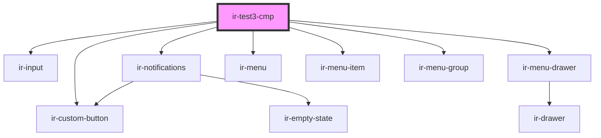

# ir-test-cmp

<!-- Auto Generated Below -->

## Dependencies

### Depends on

- [ir-custom-button](../ui/ir-custom-button)
- [ir-input](../ui/ir-input)
- [ir-notifications](../ir-notifications)
- [ir-menu-drawer](../ir-menu-drawer)
- [ir-menu](../ir-menu)
- [ir-menu-item](../ir-menu-item)
- [ir-menu-group](../ir-menu-group)

### Graph

----------------------------------------------

*Built with [StencilJS](https://stenciljs.com/)*
