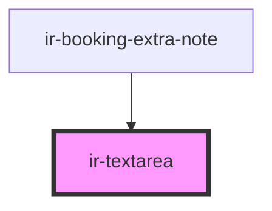

# ir-textarea

<!-- Auto Generated Below -->

## Properties

| Property            | Attribute            | Description | Type     | Default           |
| ------------------- | -------------------- | ----------- | -------- | ----------------- |
| `cols`              | `cols`               |             | `number` | `5`               |
| `label`             | `label`              |             | `string` | `'<label>'`       |
| `maxLength`         | `max-length`         |             | `number` | `undefined`       |
| `placeholder`       | `placeholder`        |             | `string` | `'<placeholder>'` |
| `rows`              | `rows`               |             | `number` | `3`               |
| `text`              | `text`               |             | `string` | `''`              |
| `textareaClassname` | `textarea-classname` |             | `string` | `undefined`       |
| `value`             | `value`              |             | `string` | `''`              |

## Events

| Event        | Description | Type                  |
| ------------ | ----------- | --------------------- |
| `textChange` |             | `CustomEvent<string>` |

## Dependencies

### Used by

 - [ir-booking-extra-note](../ir-booking-extra-note)

### Graph

----------------------------------------------

*Built with [StencilJS](https://stenciljs.com/)*
