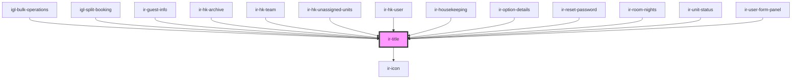

# ir-title

<!-- Auto Generated Below -->

## Properties

| Property         | Attribute         | Description | Type                                                                                                                                                                                                  | Default     |
| ---------------- | ----------------- | ----------- | ----------------------------------------------------------------------------------------------------------------------------------------------------------------------------------------------------- | ----------- |
| `borderShown`    | `border-shown`    |             | `boolean`                                                                                                                                                                                             | `undefined` |
| `displayContext` | `display-context` |             | `"default" \| "sidebar"`                                                                                                                                                                              | `'default'` |
| `justifyContent` | `justify-content` |             | `"center" \| "end" \| "flex-end" \| "flex-start" \| "left" \| "normal" \| "right" \| "safe center" \| "space-around" \| "space-between" \| "space-evenly" \| "start" \| "stretch" \| "unsafe center"` | `'start'`   |
| `label`          | `label`           |             | `string`                                                                                                                                                                                              | `undefined` |

## Events

| Event          | Description | Type                |
| -------------- | ----------- | ------------------- |
| `closeSideBar` |             | `CustomEvent<null>` |

## Dependencies

### Used by

 - [igl-bulk-operations](../igloo-calendar/igl-bulk-operations)
 - [igl-split-booking](../igloo-calendar/igl-split-booking)
 - [ir-guest-info](../ir-guest-info)
 - [ir-hk-archive](../ir-housekeeping/ir-hk-tasks/ir-hk-archive)
 - [ir-hk-team](../ir-housekeeping/ir-hk-team)
 - [ir-hk-unassigned-units](../ir-housekeeping/ir-hk-unassigned-units)
 - [ir-hk-user](../ir-housekeeping/ir-hk-user)
 - [ir-housekeeping](../ir-housekeeping)
 - [ir-option-details](../ir-payment-option/ir-option-details)
 - [ir-reset-password](../ir-reset-password)
 - [ir-room-nights](../igloo-calendar/ir-room-nights)
 - [ir-unit-status](../ir-housekeeping/ir-unit-status)
 - [ir-user-form-panel](../ir-user-management/ir-user-form-panel)

### Depends on

- [ir-icon](../ui/ir-icon)

### Graph

----------------------------------------------

*Built with [StencilJS](https://stenciljs.com/)*
