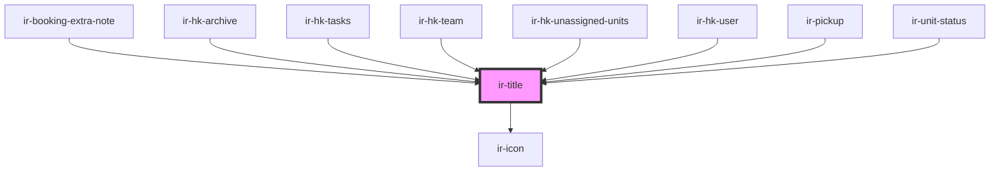

# ir-title

<!-- Auto Generated Below -->

## Properties

| Property         | Attribute         | Description | Type                                                                                                                                                                                                  | Default     |
| ---------------- | ----------------- | ----------- | ----------------------------------------------------------------------------------------------------------------------------------------------------------------------------------------------------- | ----------- |
| `displayContext` | `display-context` |             | `"default" \| "sidebar"`                                                                                                                                                                              | `'default'` |
| `justifyContent` | `justify-content` |             | `"center" \| "end" \| "flex-end" \| "flex-start" \| "left" \| "normal" \| "right" \| "safe center" \| "space-around" \| "space-between" \| "space-evenly" \| "start" \| "stretch" \| "unsafe center"` | `'start'`   |
| `label`          | `label`           |             | `string`                                                                                                                                                                                              | `undefined` |

## Events

| Event          | Description | Type                |
| -------------- | ----------- | ------------------- |
| `closeSideBar` |             | `CustomEvent<null>` |

## Dependencies

### Used by

 - [ir-booking-extra-note](../ir-booking-extra-note)
 - [ir-hk-archive](../ir-housekeeping/ir-hk-tasks/ir-hk-archive)
 - [ir-hk-tasks](../ir-housekeeping/ir-hk-tasks)
 - [ir-hk-team](../ir-housekeeping/ir-hk-team)
 - [ir-hk-unassigned-units](../ir-housekeeping/ir-hk-unassigned-units)
 - [ir-hk-user](../ir-housekeeping/ir-hk-user)
 - [ir-pickup](../ir-booking-details/ir-pickup)
 - [ir-unit-status](../ir-housekeeping/ir-unit-status)

### Depends on

- [ir-icon](../ir-icon)

### Graph

----------------------------------------------

*Built with [StencilJS](https://stenciljs.com/)*
