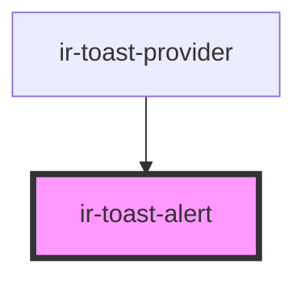

# ir-toast-alert

<!-- Auto Generated Below -->

## Properties

| Property               | Attribute      | Description                                                                   | Type                                                           | Default       |
| ---------------------- | -------------- | ----------------------------------------------------------------------------- | -------------------------------------------------------------- | ------------- |
| `actionLabel`          | `action-label` | Optional primary action label                                                 | `string`                                                       | `undefined`   |
| `description`          | `description`  | Plain text description for the toast body                                     | `string`                                                       | `undefined`   |
| `dismissible`          | `dismissible`  | Whether the close button should be rendered                                   | `boolean`                                                      | `true`        |
| `label`                | `label`        | Heading displayed at the top of the toast                                     | `string`                                                       | `undefined`   |
| `leaving`              | `leaving`      | Indicates when the provider is playing the exit animation                     | `boolean`                                                      | `false`       |
| `position`             | `position`     | Toast position drives enter/exit direction                                    | `"bottom-left" \| "bottom-right" \| "top-left" \| "top-right"` | `'top-right'` |
| `toastId` _(required)_ | `toast-id`     | Unique identifier passed back to the provider when interacting with the toast | `string`                                                       | `undefined`   |
| `variant`              | `variant`      | Maps to visual style tokens                                                   | `"danger" \| "info" \| "success" \| "warning"`                 | `'info'`      |

## Events

| Event                      | Description | Type                                                 |
| -------------------------- | ----------- | ---------------------------------------------------- |
| `irToastAction`            |             | `CustomEvent<{ id: string; }>`                       |
| `irToastDismiss`           |             | `CustomEvent<{ id: string; reason: "manual"; }>`     |
| `irToastInteractionChange` |             | `CustomEvent<{ id: string; interacting: boolean; }>` |

## Dependencies

### Used by

 - [ir-toast-provider](../ir-toast-provider)

### Graph

----------------------------------------------

*Built with [StencilJS](https://stenciljs.com/)*
