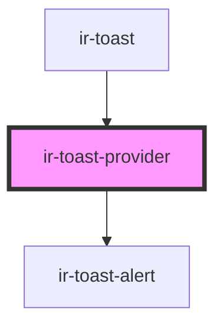

# ir-toast-provider

<!-- Auto Generated Below -->

## Properties

| Property   | Attribute  | Description | Type                                                                                            | Default     |
| ---------- | ---------- | ----------- | ----------------------------------------------------------------------------------------------- | ----------- |
| `duration` | `duration` |             | `number`                                                                                        | `5000`      |
| `position` | `position` |             | `"bottom-center" \| "bottom-end" \| "bottom-start" \| "top-center" \| "top-end" \| "top-start"` | `'top-end'` |
| `rtl`      | `rtl`      |             | `boolean`                                                                                       | `false`     |

## Methods

### `addToast(toast: Toast) => Promise<string>`

#### Parameters

| Name    | Type    | Description |
| ------- | ------- | ----------- |
| `toast` | `Toast` |             |

#### Returns

Type: `Promise<string>`

### `clearAllToasts() => Promise<void>`

#### Returns

Type: `Promise<void>`

### `removeToast(id: string) => Promise<void>`

#### Parameters

| Name | Type     | Description |
| ---- | -------- | ----------- |
| `id` | `string` |             |

#### Returns

Type: `Promise<void>`

## Dependencies

### Used by

 - [ir-toast](../ui/ir-toast)

### Depends on

- [ir-toast-alert](../ir-toast-alert)

### Graph

----------------------------------------------

*Built with [StencilJS](https://stenciljs.com/)*
