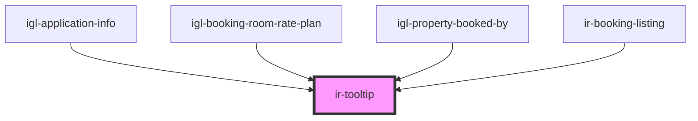

# ir-tooltip

<!-- Auto Generated Below -->

## Properties

| Property     | Attribute     | Description | Type      | Default     |
| ------------ | ------------- | ----------- | --------- | ----------- |
| `customSlot` | `custom-slot` |             | `boolean` | `false`     |
| `message`    | `message`     |             | `string`  | `undefined` |
| `withHtml`   | `with-html`   |             | `boolean` | `true`      |

## Dependencies

### Used by

 - [igl-application-info](../igloo-calendar/igl-application-info)
 - [igl-booking-room-rate-plan](../igloo-calendar/igl-booking-room-rate-plan)
 - [igl-property-booked-by](../igloo-calendar/igl-property-booked-by)
 - [ir-booking-listing](../ir-booking-listing)

### Graph

----------------------------------------------

*Built with [StencilJS](https://stenciljs.com/)*
