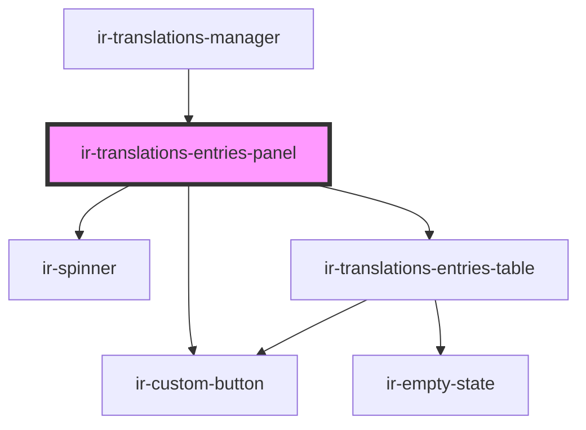

# ir-translations-entries-panel

<!-- Auto Generated Below -->

## Overview

Owns the entries table plus its client-side search/status filtering — the
parent manager just hands it one table's raw entries and listens for the
CRUD intents it emits.

## Properties

| Property          | Attribute           | Description                                                                                                           | Type                    | Default     |
| ----------------- | ------------------- | --------------------------------------------------------------------------------------------------------------------- | ----------------------- | ----------- |
| `changedEntryIds` | --                  | Ids of rows whose position differs from the last-loaded/saved order — marked in the table while a reorder is pending. | `Set<string>`           | `new Set()` |
| `disableActions`  | `disable-actions`   | Disables the "New key" action, e.g. while another write is in flight.                                                 | `boolean`               | `false`     |
| `entries`         | --                  | The active table's unfiltered entries — filtered internally for display.                                              | `TranslationEntry[]`    | `[]`        |
| `hasPendingOrder` | `has-pending-order` | True once a drag reorder is applied locally but not yet saved — shows the Save/Discard order buttons.                 | `boolean`               | `false`     |
| `isLoading`       | `is-loading`        | True while the active table's keys are still loading.                                                                 | `boolean`               | `false`     |
| `languages`       | --                  |                                                                                                                       | `TranslationLanguage[]` | `[]`        |
| `sourceCode`      | `source-code`       |                                                                                                                       | `string`                | `undefined` |

## Events

| Event              | Description | Type                              |
| ------------------ | ----------- | --------------------------------- |
| `createEntry`      |             | `CustomEvent<void>`               |
| `deleteEntry`      |             | `CustomEvent<TranslationEntry>`   |
| `discardOrder`     |             | `CustomEvent<void>`               |
| `duplicateEntry`   |             | `CustomEvent<TranslationEntry>`   |
| `editEntry`        |             | `CustomEvent<TranslationEntry>`   |
| `entryChange`      |             | `CustomEvent<TranslationEntry>`   |
| `reorderEntries`   |             | `CustomEvent<TranslationEntry[]>` |
| `saveOrder`        |             | `CustomEvent<void>`               |
| `toggleVisibility` |             | `CustomEvent<TranslationEntry>`   |

## Dependencies

### Used by

 - [ir-translations-manager](..)

### Depends on

- [ir-custom-button](../../ui/ir-custom-button)
- [ir-spinner](../../ui/ir-spinner)
- [ir-translations-entries-table](../ir-translations-entries-table)

### Graph

----------------------------------------------

*Built with [StencilJS](https://stenciljs.com/)*
