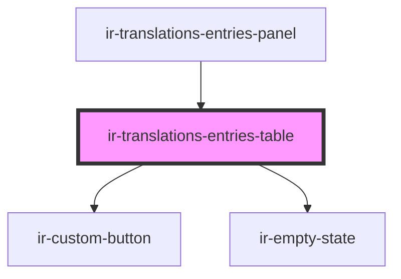

# ir-translations-entries-table

<!-- Auto Generated Below -->

## Properties

| Property          | Attribute         | Description                                                                                                       | Type                    | Default     |
| ----------------- | ----------------- | ----------------------------------------------------------------------------------------------------------------- | ----------------------- | ----------- |
| `changedEntryIds` | --                | Ids of rows whose position differs from the last-loaded/saved order — highlighted while a reorder is pending.     | `Set<string>`           | `new Set()` |
| `compact`         | `compact`         |                                                                                                                   | `boolean`               | `true`      |
| `entries`         | --                | Rows to render, already filtered by the parent.                                                                   | `TranslationEntry[]`    | `[]`        |
| `filtered`        | `filtered`        | True when the parent's filters hid every row, so the empty state can say so.                                      | `boolean`               | `false`     |
| `languages`       | --                | Column order — the source language is expected first.                                                             | `TranslationLanguage[]` | `[]`        |
| `reorderEnabled`  | `reorder-enabled` | False while a search/status filter is active — reordering a filtered subset can't map cleanly onto the full list. | `boolean`               | `true`      |
| `sourceCode`      | `source-code`     | Code of the reference language, marked in the header.                                                             | `string`                | `undefined` |

## Events

| Event              | Description | Type                              |
| ------------------ | ----------- | --------------------------------- |
| `clearFilters`     |             | `CustomEvent<void>`               |
| `deleteEntry`      |             | `CustomEvent<TranslationEntry>`   |
| `duplicateEntry`   |             | `CustomEvent<TranslationEntry>`   |
| `editEntry`        |             | `CustomEvent<TranslationEntry>`   |
| `entryChange`      |             | `CustomEvent<TranslationEntry>`   |
| `reorderEntries`   |             | `CustomEvent<TranslationEntry[]>` |
| `toggleVisibility` |             | `CustomEvent<TranslationEntry>`   |

## Dependencies

### Used by

 - [ir-translations-entries-panel](../ir-translations-entries-panel)

### Depends on

- [ir-custom-button](../../ui/ir-custom-button)
- [ir-empty-state](../../ir-empty-state)

### Graph

----------------------------------------------

*Built with [StencilJS](https://stenciljs.com/)*
