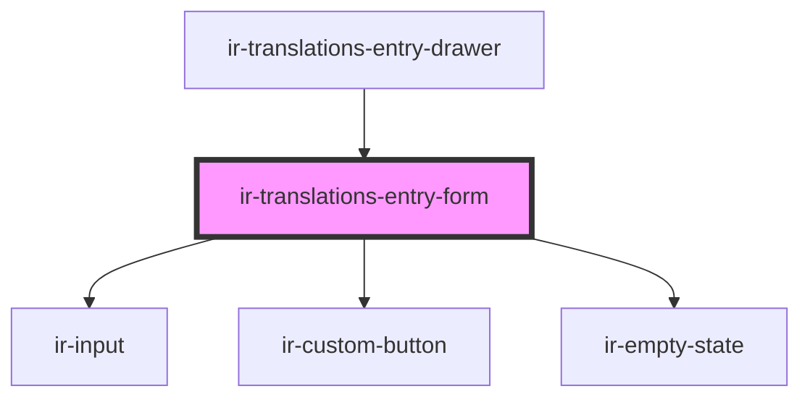

# ir-translations-entry-form

<!-- Auto Generated Below -->

## Overview

Owns the create/edit draft for a single translation key and saves it directly —
the drawer around this form is a dumb open/close shell.

## Properties

| Property           | Attribute            | Description                                                                                 | Type                    | Default     |
| ------------------ | -------------------- | ------------------------------------------------------------------------------------------- | ----------------------- | ----------- |
| `entry`            | --                   | The entry being edited. Null puts the form in create mode.                                  | `TranslationEntry`      | `null`      |
| `entryUserId`      | `entry-user-id`      |                                                                                             | `number`                | `undefined` |
| `existingKeys`     | --                   | Keys already used in the active table, for duplicate detection.                             | `string[]`              | `[]`        |
| `formId`           | `form-id`            |                                                                                             | `string`                | `undefined` |
| `languages`        | --                   |                                                                                             | `TranslationLanguage[]` | `[]`        |
| `nextDisplayOrder` | `next-display-order` | DISPLAY_ORDER a brand-new key should get — one past the highest order already in the table. | `number`                | `0`         |
| `ownerId`          | `owner-id`           |                                                                                             | `number`                | `undefined` |
| `tableName`        | `table-name`         |                                                                                             | `string`                | `undefined` |

## Events

| Event                  | Description | Type                   |
| ---------------------- | ----------- | ---------------------- |
| `entrySaved`           |             | `CustomEvent<void>`    |
| `isSubmittingChange`   |             | `CustomEvent<boolean>` |
| `submitDisabledChange` |             | `CustomEvent<boolean>` |

## Dependencies

### Used by

 - [ir-translations-entry-drawer](..)

### Depends on

- [ir-input](../../../ui/ir-input)
- [ir-custom-button](../../../ui/ir-custom-button)
- [ir-empty-state](../../../ir-empty-state)

### Graph

----------------------------------------------

*Built with [StencilJS](https://stenciljs.com/)*
