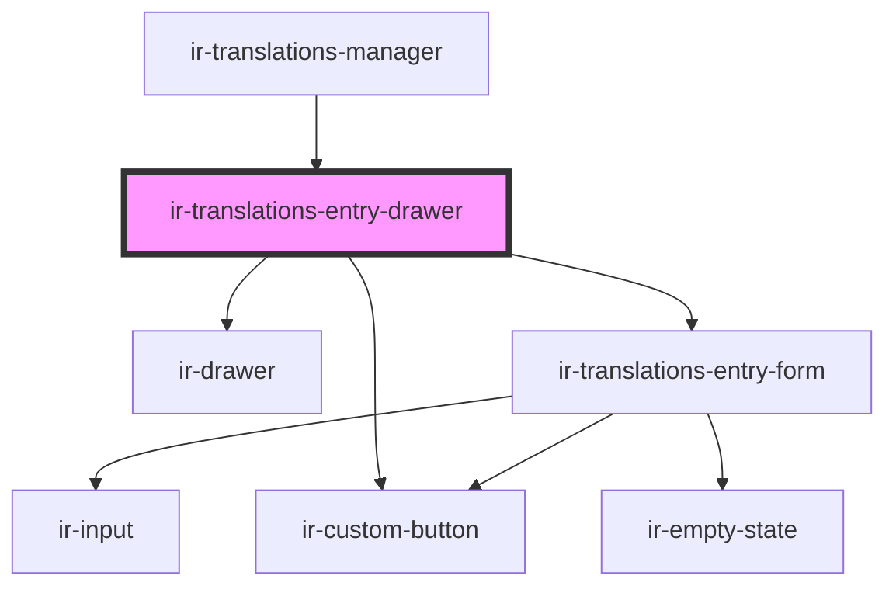

# ir-translations-entry-drawer

<!-- Auto Generated Below -->

## Overview

Dumb open/close shell — the nested ir-translations-entry-form owns the
draft, validation, and the actual save call.

## Properties

| Property           | Attribute            | Description                                                                                 | Type                    | Default                     |
| ------------------ | -------------------- | ------------------------------------------------------------------------------------------- | ----------------------- | --------------------------- |
| `entry`            | --                   | The entry being edited. Null puts the drawer in create mode.                                | `TranslationEntry`      | `null`                      |
| `entryUserId`      | `entry-user-id`      |                                                                                             | `number`                | `undefined`                 |
| `existingKeys`     | --                   | Keys already used in the active table, for duplicate detection.                             | `string[]`              | `[]`                        |
| `formId`           | `form-id`            |                                                                                             | `string`                | `'translations-entry-form'` |
| `languages`        | --                   |                                                                                             | `TranslationLanguage[]` | `[]`                        |
| `nextDisplayOrder` | `next-display-order` | DISPLAY_ORDER a brand-new key should get — one past the highest order already in the table. | `number`                | `0`                         |
| `open`             | `open`               |                                                                                             | `boolean`               | `false`                     |
| `ownerId`          | `owner-id`           |                                                                                             | `number`                | `undefined`                 |
| `tableName`        | `table-name`         |                                                                                             | `string`                | `undefined`                 |

## Events

| Event         | Description | Type                |
| ------------- | ----------- | ------------------- |
| `closeDrawer` |             | `CustomEvent<void>` |
| `entrySaved`  |             | `CustomEvent<void>` |

## Dependencies

### Used by

 - [ir-translations-manager](..)

### Depends on

- [ir-drawer](../../ir-drawer)
- [ir-translations-entry-form](ir-translations-entry-form)
- [ir-custom-button](../../ui/ir-custom-button)

### Graph

----------------------------------------------

*Built with [StencilJS](https://stenciljs.com/)*
